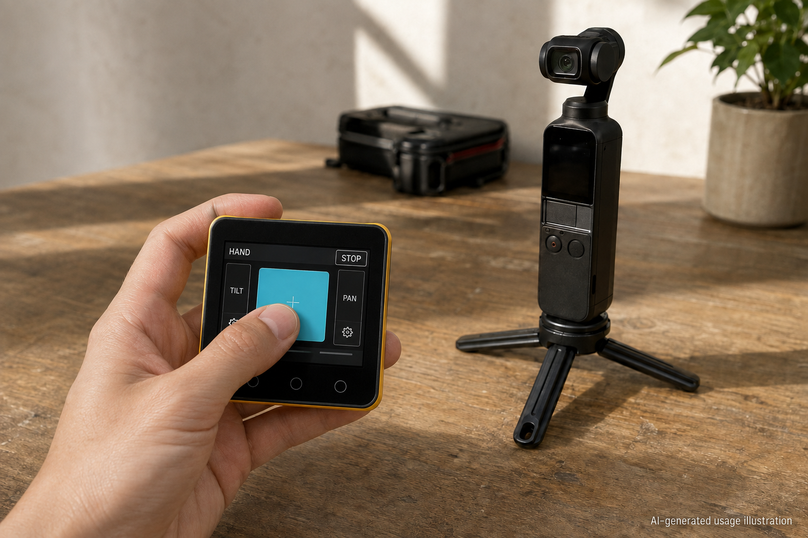
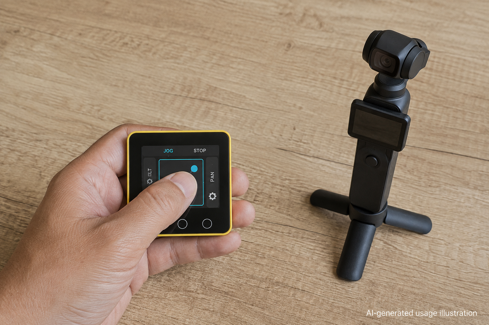

# OsmoPalm

A standalone, one-thumb M5Stack Core2 controller for DJI Osmo Pocket gimbals.
BLE pairing, camera Wi-Fi, control and telemetry run on the Core2 itself: no phone,
computer or USB host is required during standalone operation.

## Download the preview

[**v0.1.0-preview.1 release and firmware downloads**](https://github.com/ElectronicPaper/OsmoPalm/releases/tag/v0.1.0-preview.1)

This is a prerelease, not stable v1.0. Read the [release notes](docs/releases/v0.1.0-preview.1.md)
and [flashing guide](docs/FLASHING.md) before installing. The firmware still identifies itself
as `7.9.1-return-icon`; the new release label does not imply a rewritten or newly camera-qualified build.

## Camera compatibility

| Camera | Status |
|---|---|
| Osmo Pocket 4 Pro (4P) | Development-tested: standalone connection, telemetry and controls have been exercised. Not every feature or camera firmware is certified. |
| Osmo Pocket 4 | Potentially compatible. **We have not tested it yet.** |
| Osmo Pocket 3 | Potentially compatible. **We have not tested it yet.** |

Pocket 4/3 compatibility is an inference from the shared protocol/discovery paths, not a
guarantee. See the release notes for evidence and limitations.
Core2 uses 2.4 GHz Wi-Fi; a camera AP available only on 5 GHz cannot be joined.

## How it works



**HAND:** hold the central pad and move the controller to guide the gimbal. Release to end
manual control; release easing follows your settings, while STOP overrides it immediately.



**JOG:** drag within the central square to control direction and speed. Tilt/Pan constraints
and their settings are beside the pad. Standalone operation needs no phone or computer.

*AI-generated usage illustrations, not test photos or exact UI/hardware reproductions.
They do not prove successful operation or camera compatibility.*
[Image provenance and prompts](docs/images/README.md).

## Included

- 320x240 HAND and JOG controls with square touch pads, tilt/pan locks and per-axis easing.
- Relative-pose clutch control, sensitivity/weight profiles, inversion and bounded haptics.
- On-device camera discovery, pairing, trusted-device management and connection progress.
- Saved positions, transitions and bounded motion playback with deliberate holds.
- Camera controls, record-intent/tally distinction, persistent settings and emergency STOP.
- Optional USB interoperability with [OsmoDesk](https://github.com/ElectronicPaper/OsmoDesk).

The firmware source is preserved from the current controller snapshot, version
`7.9.1-return-icon`. This split changes repository packaging and tests, not gimbal behavior.
Camera capabilities depend on model/firmware. Unconfirmed focus actions are not marketed
as verified manual follow focus. Offline tests and builds do not prove live motion or comfort.

## Build and test

Install Python 3.10+, PlatformIO and a C++17 compiler (for native tests).
From this repository root:

```sh
python -B -m unittest discover -s tests -t .
pio run --project-dir firmware/core2_panel
```

Python source-contract tests need no desktop driver or third-party Python packages.
Native tests report a skip if no C++ compiler is available; install one for the full gate.

To flash, identify your own Core2 serial port, then use:
```sh
pio run --project-dir firmware/core2_panel -t upload --upload-port YOUR_CORE2_PORT
```

Only flash the intended device, keep the gimbal area clear, and verify the firmware hello,
IMU output and absence of reboot/panic after upload. Do not erase saved settings as a routine
recovery step. The device learns camera credentials through pairing; do not commit them.

## Split verification (2026-09-07)

355 offline tests passed with no skips, including native C++ tests. A clean firmware
build succeeded with the pinned toolchain/libraries. Six paired checks against OsmoDesk
passed. These are local checks; they do not claim fresh hardware acceptance.

## Working with the other controller

[Cross-project workflow](docs/CROSS_PROJECT.md) explains independent releases and paired
compatibility checks. [Lessons](docs/LESSONS.md) preserves the important R&D findings.
The UI skill under .agents/skills is mirrored for Claude under .claude/skills.

Private R&D snapshot, not a market-ready certification. No firmware was flashed as part of
the repository split. See [third-party notices](THIRD_PARTY_NOTICES.md) before redistribution.
Not affiliated with DJI.
